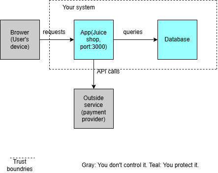

# Threat Model: Juice Shop (AppSec Lab)

## 1. Scope
Target: OWASP Juice Shop running locally in Docker (`http://localhost:3000`).
Method: data flow diagram + STRIDE on each arrow, then rank by Likelihood x Impact.

## 2. Data flow diagram

Components: Browser -> App -> Database, and App -> Outside services.
Trust boundary: the dashed box around App and Database ("Your system").
Arrows that cross the boundary: Browser -> App, App -> Outside services.

## 3. Scoring
- Likelihood: 1 (hard to do) to 3 (easy to do)
- Impact: 1 (minor) to 3 (severe)
- Score = Likelihood x Impact (1 to 9)
- Ties are ordered by how easily the risk can be tested in Juice Shop (Step 3).

These scores are starting estimates. Adjust them if your own testing shows a risk is easier or harder than expected, and note why.

## 4. Top 10 ranked risks

| Rank | Arrow | STRIDE | What could go wrong | Likelihood | Impact | Score |
|---|---|---|---|---|---|---|
| 1 | Browser -> App | Spoofing | An attacker logs in as another user (or admin) by guessing a weak password or bypassing the login with SQL injection | 3 | 3 | 9 |
| 2 | Browser -> App | Elevation of privilege | A normal user reaches the admin page, or changes an ID in the URL to see someone else's account | 3 | 3 | 9 |
| 3 | App -> Database | Tampering | SQL injection lets an attacker change or delete records, such as prices or user accounts | 3 | 3 | 9 |
| 4 | App -> Database | Information disclosure | SQL injection or an unprotected database file exposes user emails and password hashes | 3 | 3 | 9 |
| 5 | App -> Outside services | Information disclosure | API keys are hardcoded in the code or sent in plain text, and leak through the repo or logs | 3 | 3 | 9 |
| 6 | Browser -> App | Tampering | An attacker edits a request to change a basket price or another user's order | 3 | 2 | 6 |
| 7 | Browser -> App | Information disclosure | Error messages or open API endpoints reveal database details or other users' data | 3 | 2 | 6 |
| 8 | App -> Database | Elevation of privilege | The app's database account has full admin rights, so a small flaw gives an attacker control of everything | 2 | 3 | 6 |
| 9 | App -> Database | Spoofing | The app connects with a shared or default database password that an attacker finds and reuses | 2 | 3 | 6 |
| 10 | App -> Outside services | Spoofing | An attacker fakes a response from the payment or email service, so the app believes an order was paid | 2 | 3 | 6 |

## 5. Risks not in the top 10

| Arrow | STRIDE | What could go wrong | Score |
|---|---|---|---|
| App -> Outside services | Tampering | Data sent to or from the service is changed in transit because the connection isn't encrypted or checked | 6 |
| Browser -> App | Repudiation | A user deletes or changes data and there are no logs to show who did it | 4 |
| Browser -> App | Denial of service | Flooding the login or search page with requests makes the shop unavailable | 4 |
| App -> Database | Repudiation | Changes to the database are not logged, so nobody can tell who changed what | 4 |
| App -> Database | Denial of service | Expensive queries or a flood of requests slow the database until the shop stops responding | 4 |
| App -> Outside services | Repudiation | There is no record of which payments or emails were sent, so disputes can't be resolved | 4 |
| App -> Outside services | Denial of service | The outside service goes down and the app freezes because it waits for a reply forever | 4 |
| App -> Outside services | Elevation of privilege | The app's API key has more permissions than it needs, so a stolen key lets an attacker do far more | 4 |

Note: the three repudiation risks share one fix (logging), which is covered in Step 6 of the project.

## 6. How these risks feed the next steps
- Step 3 (attack): test ranks 1-4, 6 and 7 directly in Juice Shop.
- Step 4 (fix): address the root cause of each attack you proved.
- Step 5 (automate): secret scanning covers rank 5.
- Step 6 (logging): covers the repudiation risks in section 5.

