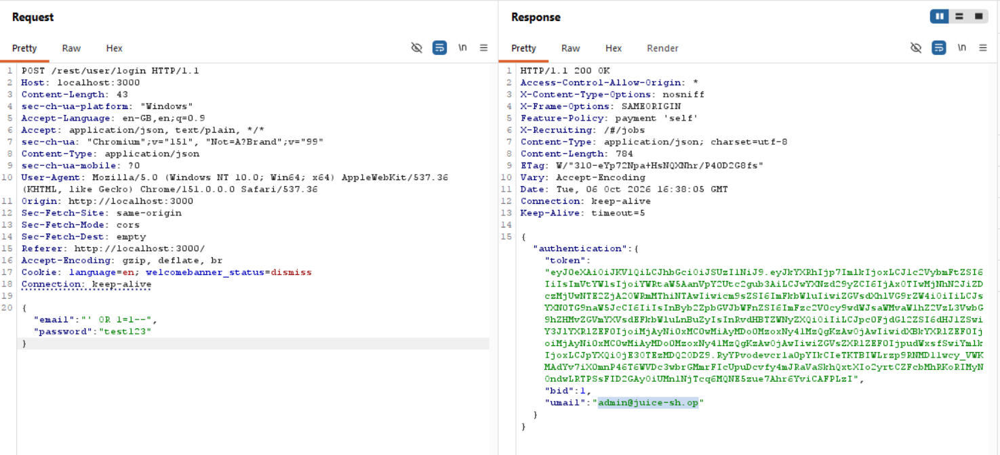
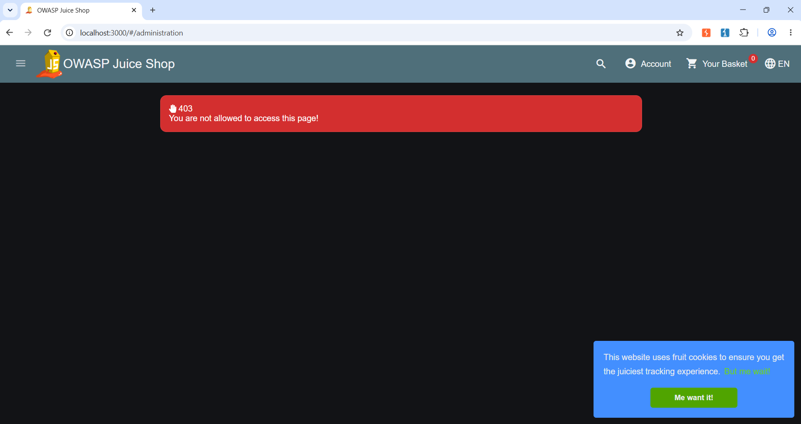
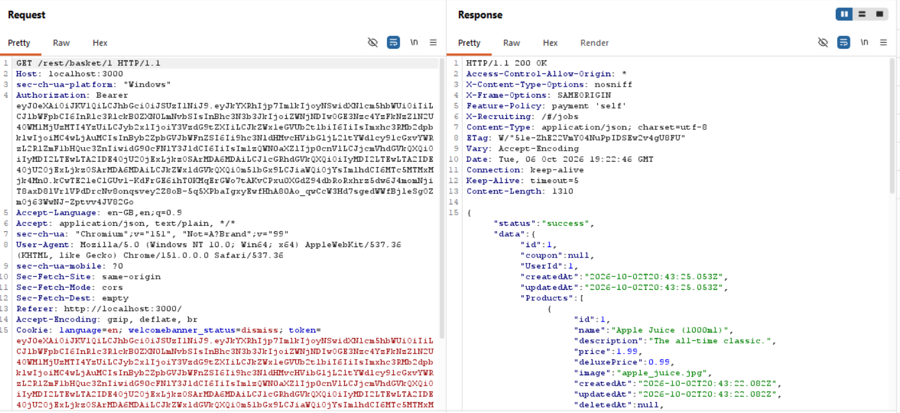
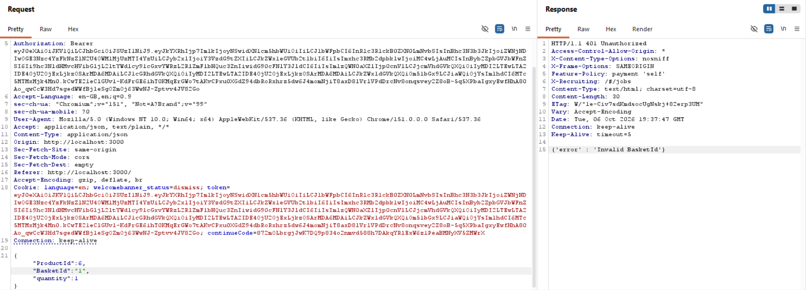
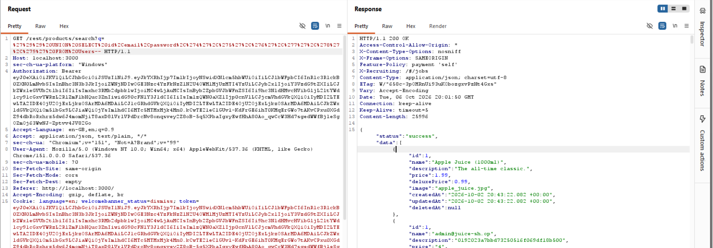

## Attack 1: Login bypass via SQL injection

**Threat model rank:** 1 (Spoofing) and 3 (SQL injection, App → Database)

**What I did:**
Sent a login request to /rest/user/login with:
{"email":"' OR 1=1--","password":"anything"}

**What happened:**
Received a 200 response with an auth token and user data for
admin@juice-sh.op. This logged me in as the site admin without
knowing any password. The app builds a database query using the
email field directly, and the injected `' OR 1=1--` closes the
string early, adds a condition that's always true, and comments
out the rest of the query — so the database returns the first
matching user (the admin) regardless of password.

**Screenshot:** 

## Check: Admin section access control

**Threat model rank:** 2 (Elevation of privilege, Browser → App)

**What I did:**
Logged in as a normal user and navigated to
http://localhost:3000/#/administration

**What happened:**
Received "You are not allowed to access this page." The app
correctly blocks non-admin users from this page. This risk
appears to be mitigated here — no fix needed for this specific
path.

**Screenshot:** 

## Attack 2a: Viewing another user's basket (IDOR)

**Threat model rank:** 2 (Elevation of privilege, Browser → App)

**What I did:**
Logged in as my test account (basket ID 6). Sent a GET request
for /rest/basket/6 to Repeater to confirm it returned my own
items, then changed the URL to /rest/basket/1 and sent it again.

**What happened:**
Received a 200 response with full basket contents belonging to
UserId 1 (likely the first account created, often the admin) —
Apple Juice, Orange Juice, and Eggfruit Juice with quantities and
timestamps. No authorization check prevented me from viewing a
basket that isn't mine. This is an Insecure Direct Object
Reference (IDOR): the app trusts the ID in the URL without
checking it belongs to the logged-in user.

**Screenshot:** 

## Attack 2b: Attempting to modify another user's basket

**Threat model rank:** 2 (Elevation of privilege, Browser → App)

**What I did:**
Sent a POST to /api/BasketItems with
{"ProductId":2,"BasketId":"1","quantity":1} — attempting to add
an item to basket ID 1, which belongs to another user (not mine,
ID 6).

**What happened:**
Received 401 Unauthorized: {"error":"Invalid BasketId"}. Unlike
viewing the basket (Attack 2), writing to it is checked against
the logged-in user. This shows an inconsistency: the GET endpoint
trusts the ID in the URL, but the POST endpoint validates it.

**Screenshot:** 

## Attack 3: SQL injection via search bar — full user data dump

**Threat model rank:** 3 (SQL injection, App → Database) and
4 (Information disclosure, App → Database)

**What I did:**
Sent a search request to /rest/products/search with the query:
')) UNION SELECT id, email, password, '4', '5', '6', '7', '8', '9' FROM Users--
(URL-encoded before sending)

**What happened:**
Received a 200 response containing the full Users table — every
account's email address and password hash — disguised as product
entries. Confirmed accounts include admin@juice-sh.op,
ciso@juice-sh.op, support@juice-sh.op, and 40+ others. This is a
complete, unauthenticated database dump through a public search
feature, with no login required at all.

**Severity:** Critical. This exposes every user's credentials in
one request, with no authentication or rate limiting observed.

**Screenshot:** 
